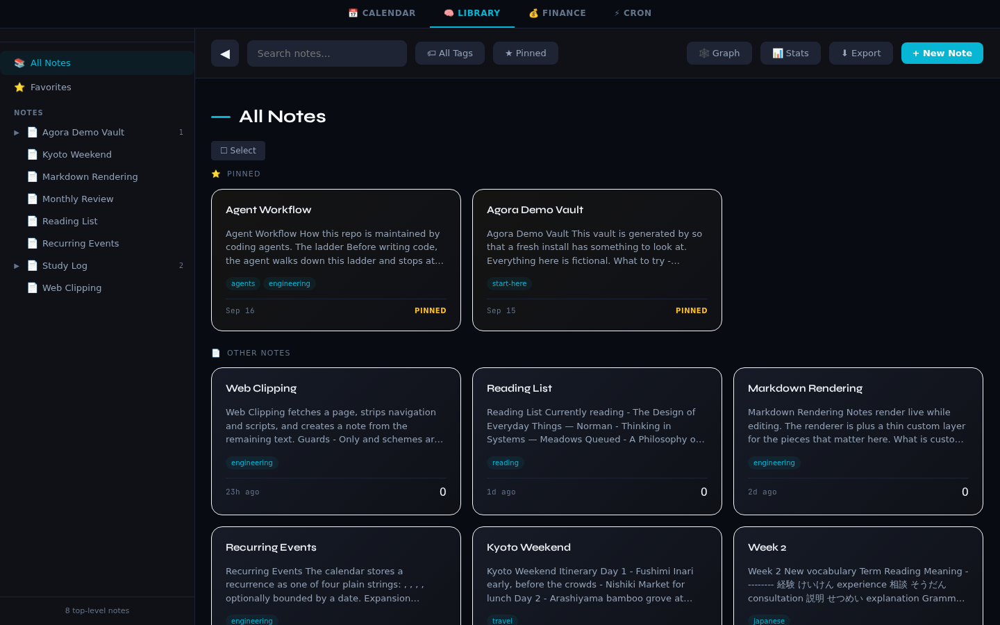
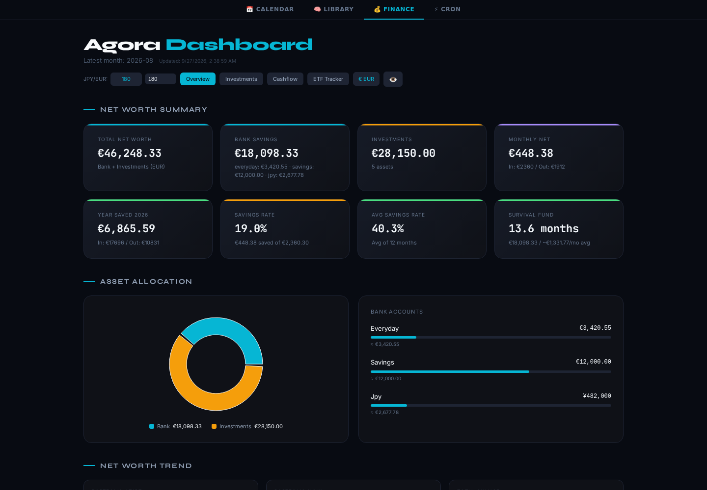
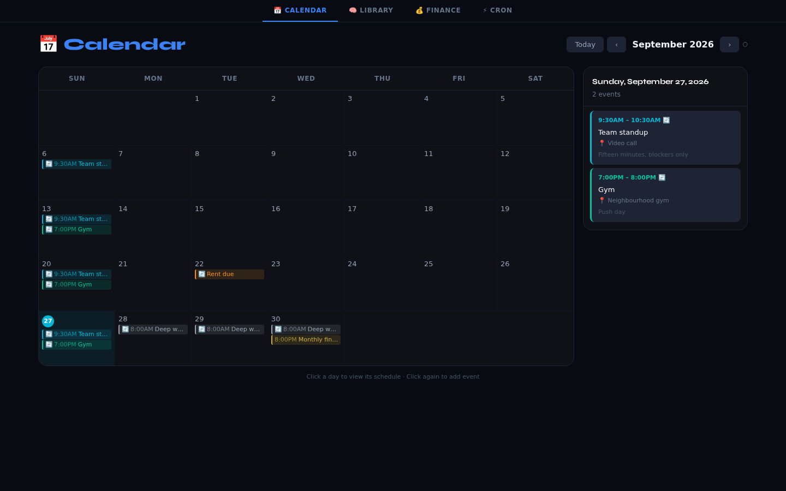
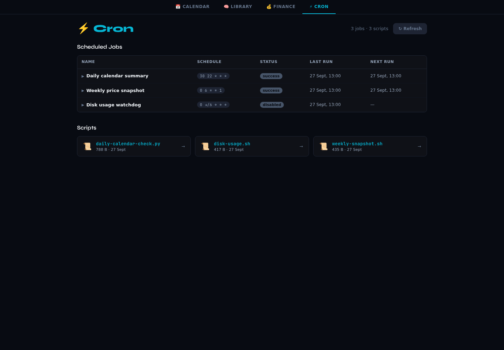

# Agora

A self-hosted personal knowledge, calendar and finance dashboard in one app.

Agora is a single FastAPI service that serves a React SPA, keeps everything in
one SQLite file, and turns a pile of exported CSV statements into a finance
dashboard with live market data. It runs in one container, has no external
services to babysit, and the whole database is a single file you can copy for a
backup.

Four modules live behind one navigation bar:

- **Library**: markdown notes with full text search, tags, folders, a note
  hierarchy, pinned notes, wiki links with backlinks, inline task checkboxes,
  file attachments, a link graph, web clipping and JSON export/import.
- **Calendar**: local events with daily/weekly/monthly/yearly recurrence,
  per-occurrence exclusions, an optional read-only Google Calendar feed, and an
  iCal endpoint you can subscribe to from a phone.
- **Finance**: seven CSV exports parsed into a dashboard with net worth,
  allocation across ETFs, gold and crypto, monthly cashflow, year to date
  figures, savings rate, survival fund and a live ETF/crypto price tracker.
- **Cron**: a read-only mirror of a scheduled job runner, with a script list and
  viewer.

## Screenshots

All four tabs, captured from the container running on the generated demo data.

**Library**: full text search, tags, pinned notes, a note hierarchy and the
wiki-link graph.



**Finance**: net worth, allocation, savings rate and survival fund, computed from
the CSV exports, with live prices on the ETF tracker tab.



**Calendar**: month view with recurring events expanded, and the day panel.



**Cron**: the synced job list with schedules, last status and next run, plus the
script viewer.



Regenerate them with `./docs/capture_screenshots.sh http://localhost:8080` while
the app is running. The headline figures animate on load, so a capture taken too
early shows them mid-count.

## Stack

| Layer | Choice |
|---|---|
| API | FastAPI, Pydantic v2, Uvicorn |
| Storage | SQLite via the `sqlite3` standard library, WAL journal |
| Frontend | React 19, Vite 7, React Router 7 |
| Charts | Recharts, vis-network |
| Editor | CodeMirror 6 |
| Markdown | `marked` plus a small preprocessing layer, sanitised with DOMPurify |
| Calendar | `icalendar` for export, `dateutil.rrule` for feed parsing |
| Scraping | `requests` plus BeautifulSoup for the web clipper |
| Tests | pytest, vitest, ESLint |
| Packaging | Multi-stage Dockerfile, Docker Compose |

Around 3,100 lines of Python and 8,000 lines of JavaScript/JSX, with 400 lines
of backend tests and 18 frontend unit tests.

## Architecture

```
                    ┌──────────────────────────────────────────┐
   browser  ──────► │  FastAPI (uvicorn :8000)                 │
                    │                                          │
                    │  /api/notes     notes, tags, attachments  │
                    │  /api/tree      note hierarchy            │
                    │  /api/stats     activity + summary        │
                    │  /api/graph     wiki-link graph           │
                    │  /api/export    JSON dump / import        │
                    │  /api/clip      fetch a page into a note  │
                    │  /api/finance   CSV → JSON, market data   │
                    │  /api/calendar  events, recurrence, iCal  │
                    │  /api/cron      job mirror + scripts      │
                    │  /*             built React SPA            │
                    └───────┬───────────────────────┬──────────┘
                            │                       │
                    SQLite (notes,          CSV exports in
                    tags, events)           FINANCE_DATA_DIR
                            │                       │
                    one file, one           produced by any
                    backup target           accounting pipeline
                                                    │
                                            finance-query.com
                                            Yahoo chart API
                                            (with fallbacks)
```

Design rules the code follows:

1. **CSV and JSON in, JSON out.** The backend parses upstream CSV once and
   serves clean JSON. The React app never parses a CSV, so number and currency
   handling lives in one place instead of two.
2. **Expansion at read time.** A recurring calendar event is one row. The range
   query walks it forward and returns occurrences, so nothing has to run in the
   background.
3. **Degrade, never blank.** Market data has a primary source and a paced
   fallback; the exchange rate falls back to a fixed rate; a missing finance CSV
   returns 404 for that panel only and the rest of the dashboard still renders.
4. **The SPA is the last route registered.** It has a catch-all, so any route
   added after it would be unreachable.

### Directory layout

```
backend/
  main.py              app assembly, CORS, SPA serving, startup seeding
  database.py          connection helper, schema, migrations
  models.py            Pydantic request bodies
  demo_seed.py         demo content, only runs when DEMO_MODE=1 and DB empty
  ical_feed.py         read-only Google Calendar feed (optional)
  routers/
    notes.py           notes, tags, attachments, tree, stats, graph, export, clip, code
    finance.py         CSV parsers, exchange rate, ETF tracker with Yahoo fallback
    calendar.py        event CRUD, recurrence expansion, iCal export
    cron.py            job mirror, script list and viewer
  tests/               pytest suite (49 tests)
frontend/
  src/App.jsx          app shell and the finance dashboard
  src/library/         notes UI: grid, detail, editor, preview, graph
  src/calendar/        month view and event modal
  src/cron/            job list, script viewer
  src/finance/         ETF tracker and API client
  src/lib/parsers.js   pure parsing helpers, unit tested
demo/
  generate_demo_data.py  rebuilds the CSV and cron fixtures
  finance/               generated CSV exports
  scripts/               example cron scripts
scripts/
  csv_investments.sh     the hledger queries that produce the finance CSVs
docs/
  capture_screenshots.sh  regenerates the screenshots
  screenshots/            the images used above
```

## Quick start

```bash
git clone <repo-url> ai_agora
cd ai_agora
docker compose up --build
open http://localhost:8080
```

That is the whole setup. The image builds the React app, installs the Python
dependencies, and the container starts with demo data so there is something to
look at immediately.

Set `DEMO_MODE=0` and replace the read-only demo mounts with your own data
directory to run it for real.

### Local development

Two terminals, no Docker:

```bash
# API on :8000
cd backend
python -m venv .venv && . .venv/bin/activate
pip install -r requirements.txt -r requirements-dev.txt
DEMO_MODE=1 \
AGORA_DB_PATH=../data/agora.db \
UPLOAD_DIR=../data/uploads \
FINANCE_DATA_DIR=../demo/finance \
CRON_JSON_PATH=../demo/cron.json \
CRON_SCRIPTS_DIR=../demo/scripts \
uvicorn main:app --reload
```

```bash
# SPA on :5173 with /api proxied to the API on :8000 (see vite.config.js)
cd frontend
npm install
npm run dev
```

Or build the SPA and let FastAPI serve it, which is how the container runs:

```bash
cd frontend && npm run build
cd ../backend && REACT_DIST=../frontend/dist uvicorn main:app --port 8000
```

Then open http://localhost:8000 and both the UI and the API come from one
origin, exactly as in the container.

## Configuration

Every setting is an environment variable with a working default. See
`.env.example` for the annotated list.

| Variable | Default | Purpose |
|---|---|---|
| `DEMO_MODE` | `0` | Seed an empty database with fictional content and make write-through endpoints read-only |
| `AGORA_PORT` | `8080` | Host port for the UI and API |
| `AGORA_DB_PATH` | `/data/agora.db` | SQLite file |
| `UPLOAD_DIR` | `/data/uploads` | Note attachments |
| `FINANCE_DATA_DIR` | `/data/finance` | Directory holding the CSV exports |
| `CRON_JSON_PATH` | `/data/cron.json` | Synced job list shown in the Cron tab |
| `CRON_SCRIPTS_DIR` | `/data/scripts` | Scripts shown in the Cron tab |
| `REACT_DIST` | `/app/frontend` | Built SPA to serve |
| `CORS_ORIGINS` | localhost:5173,8000,8080 | Comma-separated allowed browser origins |
| `ENABLE_CODE_EXEC` | `0` | Enables `POST /api/run-code`, which shells out to `python3`/`node` |
| `GOOGLE_ICAL_URL` | empty | Secret iCal address of a calendar to display read-only |
| `HERMES_API_URL` | `http://localhost:8080` | Job-runner API used by the Cron "run now" button |

### Demo mode

`DEMO_MODE=1` does three things:

1. Seeds an empty database with 12 notes, tags, a note hierarchy and 9 calendar
   events, so a fresh install has something to explore. It never touches a
   database that already has notes.
2. Rejects writes to `POST /api/cron/sync` and `PUT /api/cron/scripts/{name}`,
   which are mounted read-only.
3. Reports itself at `GET /api/health` as `{"status":"ok","demo":true}`.

The finance fixtures are generated, not hand-written:

```bash
python demo/generate_demo_data.py --as-of 2026-09-27
```

It rebuilds the seven CSVs and `cron.json` from a seeded RNG, so re-running it
is deterministic and shifts every date so the data always looks current.

### Finance CSV formats

| File | Shape |
|---|---|
| `bank_savings.csv` | `account,balance` with values like `3420.55 EUR` |
| `investment_value.csv` | `account,balance` in EUR |
| `investments_amount.csv` | `account,balance` in units, e.g. `0.0212 BTC` |
| `investments_cost.csv` | `account,balance` in EUR, cost basis |
| `investments-history-daily.csv` | wide: `account,2026-01-01,2026-01-02,...` |
| `last_month.csv` | single-month income statement |
| `monthly_income.csv` | multi-month income statement |

A cell can hold two currencies (`127.00 EUR, 6864 JPY`). Both amounts are kept,
one entry per currency, because the parser splits the cell instead of running
the string through `parseFloat` and silently dropping half of it.

## Finance data pipeline (hledger)

The finance tab is a read-only view of an [hledger](https://hledger.org) journal.
The books live in plain text, hledger does the accounting, and this app renders
the result. Nothing writes back to the journal.

Verified against hledger 1.32.3. It is a single static binary, so installing it
is a download, not a build.

### Journal layout

`main.journal` holds the imported bank and card transactions and pulls in the
hand-written entries:

```journal
include manual/crypto.journal
include manual/extra.journal
include manual/prices.journal
```

`manual/prices.journal` records the `P` price directives, which is what turns
`-V` and `--market` into EUR values. Without prices the valuation and the daily
history come back empty.

Always pass `-f`. With no `-f`, hledger silently falls back to
`~/.hledger.journal` and every number in the dashboard is wrong or missing.

### Generating the CSVs

`scripts/csv_investments.sh` runs the seven queries and writes the files the
backend consumes. These are the commands, if you would rather run them by hand:
(The script derives the monthly range from today's date, `-b` 11 months back and
`-e` the current month; the example below spells out one such pair.)

```bash
export LANG=C.utf8     # Japanese merchant names appear in the income statement

# Units held per asset, then the same holdings valued in EUR, then cost basis
hledger -f main.journal bal assets:investments --output-format csv              > investments_amount.csv
hledger -f main.journal bal assets:investments -V --output-format csv           > investment_value.csv
hledger -f main.journal bal assets:investments --cost --output-format csv       > investments_cost.csv

# Bank balances, all currencies
hledger -f main.journal bal ^assets:bank --output-format csv                    > bank_savings.csv

# Last month's income statement for the overview tiles
hledger -f main.journal is -p "last month" --output-format csv                  > last_month.csv

# Multi-month statement behind the cashflow trend, YTD and savings rate
hledger -f main.journal is --monthly -b 2025-09 -e 2026-09 --output-format csv  > monthly_income.csv

# Daily portfolio value in EUR, one column per day
hledger -f main.journal bal assets:investments --market -X EUR --daily --historical \
  --output-format csv                                                           > investments-history-daily.csv
```

Point the script at this app's data directory:

```bash
cd /path/to/finance                       # the directory holding main.journal
OUT=/path/to/ai_agora/data/finance ./scripts/csv_investments.sh
```

With `DEMO_MODE=0` and a bind mount, that is the whole refresh cycle: run the
queries, reload the page. The app caches nothing server side.

### What each file feeds

| CSV | Endpoint | Shown as |
|---|---|---|
| `bank_savings.csv` | `/api/finance/bank-savings` | Bank savings tile and the allocation split |
| `investment_value.csv` | `/api/finance/investment-value` | Investments tile, allocation, per-asset values |
| `investments_amount.csv` | `/api/finance/investment-amounts` | Units held per asset |
| `investments_cost.csv` | `/api/finance/investment-costs` | Cost basis, unrealised gain |
| `investments-history-daily.csv` | `/api/finance/investment-history` | Balance sheet chart |
| `last_month.csv` | `/api/finance/cashflow/latest` | Income and expense breakdown for the last month |
| `monthly_income.csv` | `/api/finance/cashflow/monthly` | Cashflow trend, YTD figures, savings rate, survival fund |

All seven have to exist and be non-empty. The dashboard checks them as a set, so
one empty export leaves the page on its loading state rather than rendering a
partial view.

### Account naming is part of the contract

The frontend strips these prefixes for display, so the journal has to use them:

- `assets:bank:<name>` for cash
- `assets:investments:<name>`, `assets:investments:etf:<ticker>` and
  `assets:investments:crypto:<ticker>` for holdings
- `expenses:<category>:<subcategory>` for spending, which is what the allocation
  pie groups on. A new top-level category needs a colour in
  `frontend/src/lib/parsers.js` to look deliberate.
- `income:<source>` for earnings

Asset names containing `gold`, `xau` or `glda` are classified as gold, and
`btc`, `eth` and the other listed tickers as crypto, with everything else treated
as an ETF. That classification drives the 65/20/15 style allocation view.

### Monthly refresh

1. Export the statements from each bank into `data/`.
2. Normalise each export to the format its rules file expects (see the bank
   format table below).
3. Dry run every import, then import: `hledger -f main.journal import <file> --rules-file rules/<bank>.rules`.
4. Delete the `.latest.*` dedup caches, which hledger writes next to the CSV being
   imported, not in the journal directory. Miss this and a re-import silently
   skips everything.
5. Run `scripts/csv_investments.sh`.

Bank format quirks worth knowing, because they all fail silently: Mizuho exports
are Shift-JIS with 12 metadata rows before the header, PayPay exports are UTF-8
with a BOM and comma-formatted amounts (`"1,984"`, which hledger reads as 1.984),
and Revolut has switched between `2026/07/01` and `2026-07-01` across releases.

The importer scripts and the rules files are not part of this repository. They
encode account numbers, merchant mappings and cardholder names, so they stay
private. Everything this app needs to read their output is above.

## API overview

The full schema is at `/docs` (Swagger) when the app is running.

| Group | Endpoints |
|---|---|
| Notes | `GET/POST /api/notes`, `GET/PUT/DELETE /api/notes/{id}`, `GET /api/notes/search`, `PATCH /api/notes/{id}/pin`, `PATCH /api/notes/{id}/toggle-task`, `GET /api/notes/{id}/backlinks` |
| Tags | `GET /api/notes/tags/all`, `GET/POST /api/notes/{id}/tags`, `DELETE /api/notes/{id}/tags/{tag_id}` |
| Attachments | `POST/GET /api/notes/{id}/attachments`, `GET/DELETE /api/notes/attachments/{id}` |
| Structure | `GET /api/tree`, `GET /api/graph`, `GET /api/stats/summary`, `GET /api/stats/activity` |
| Import/export | `GET /api/export`, `POST /api/import`, `POST /api/clip` |
| Code | `POST /api/run-code` (disabled unless `ENABLE_CODE_EXEC=1`) |
| Finance | `GET /api/finance/bank-savings`, `/investment-value`, `/investment-amounts`, `/investment-costs`, `/investment-history`, `/cashflow/latest`, `/cashflow/monthly`, `/exchange-rate`, `/etf-watchlist`, `/etf-tracker?period=&symbol=` |
| Calendar | `GET/POST /api/calendar/events`, `GET/PUT/DELETE /api/calendar/events/{id}`, `DELETE /api/calendar/events/{id}/occurrences/{date}`, `GET /api/calendar/google/status`, `GET /api/calendar/google/events`, `GET /api/calendar/ical/export` |
| Cron | `POST /api/cron/sync`, `GET /api/cron/list`, `POST /api/cron/{id}/trigger`, `GET /api/cron/scripts`, `GET/PUT /api/cron/scripts/{name}` |

Gotchas worth knowing before you touch the API:

- `GET /api/calendar/events` takes `start` and `end` query parameters.
  `POST /api/calendar/events` takes `start_date` and `end_date` in the body.
- `PUT /api/notes/{id}` replaces the note, so it must include `parent_id` or the
  note is detached from the tree.
- `GET /api/notes` returns a `summary`, not the body. Search still matches the
  full body in the database.
- Mutating collection endpoints reject a trailing slash while GET tolerates it.
- Attachment download is `GET /api/notes/attachments/{id}`, not nested under the
  note.

## Tests and lint

```bash
cd backend && python -m pytest      # 49 tests
cd frontend && npm test             # 18 tests
cd frontend && npm run lint         # 0 errors
cd frontend && npm run build
```

The backend suite runs against the real app object on a temporary database with
the demo fixtures mounted, so it exercises the actual routes, the startup
seeding, and the guards. The frontend suite covers the pure parsing helpers,
which is where the money maths lives.

Both suites earned their keep during a review of this codebase. The tests caught
`CSV_FILES` being referenced in the dashboard error panel without an import,
which meant any failed CSV load threw a `ReferenceError` and took the whole
dashboard down instead of showing the message, and they pinned the multi-currency
parsing bug described above.

## Security notes

Read this before exposing the app to a network you do not control.

- **There is no authentication.** It is designed for a private network
  (Tailscale, LAN, a reverse proxy that terminates TLS and enforces auth). This
  is a deliberate trade-off for a single-user tool, not an oversight.
- **Code execution is off by default.** `POST /api/run-code` shells out to
  `python3 -c` and `node -e`. It needs `ENABLE_CODE_EXEC=1`, and even then it
  only accepts requests whose client address is loopback. Do not enable it on a
  shared host.
- **The web clipper validates targets.** `POST /api/clip` accepts only `http`
  and `https`, resolves the hostname before connecting and refuses anything
  private, loopback or link-local, and follows at most three redirects with the
  same check on every hop. That closes the obvious SSRF hole.
- **Path handling is checked.** The SPA catch-all resolves the requested path
  and refuses anything outside the build directory. Cron script read and write
  reject `/` and `..` and re-check the resolved path.
- **CORS is explicit.** Only the origins in `CORS_ORIGINS` are allowed.
- **Secrets stay out of the repository.** The database, uploads and CSV exports
  are gitignored. The Google Calendar integration reads a secret iCal URL from
  the environment.

## Repo conventions

`AGENTS.md` documents how this repository is maintained by coding agents: an
OpenCode session with the Serena language-server tools and a code graph for
navigation, plus a "lazy senior dev" ladder that has to be walked before any
code is written (does this need to exist, is it already here, does the standard
library do it, is there a platform feature, is it an installed dependency, can
it be one line, and only then the minimum that works). Validation, error
handling, security and accessibility are never skipped for brevity.

## License

MIT. See `LICENSE`.
